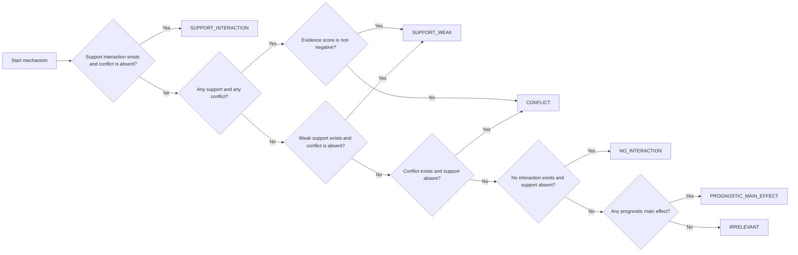

# Explaining Conditional Average Treatment Effect

This repository contains code for [CODE-XAI](https://www.medrxiv.org/content/10.1101/2024.09.04.24312866v2), explaining CATE models with attribution techniques and downstream hypothesis validation workflows.

## Prerequisites

Core CATE models are based on [CATENets](https://github.com/AliciaCurth/CATENets), which provides Torch/Jax-based sklearn-style CATE estimators.

## Core Scripts

### `single_cohort_analysis.py`

Computes SHAP values for CATE models on a single cohort using bootstrapped trials and exports JSON summaries compatible with `clinical_agent.py`.

For the current ALEX pipeline, place/expect SHAP summaries under:

`ALEX/results/<cohort>/shapley/<cohort>_shap_summary_<baseline>.json`

Example:

```bash
python single_cohort_analysis.py \
    --num_trials 20 \
    --cohort_name crash_2 \
    --baseline \
    --wandb \
    --relative_change_threshold 0.05 \
    --top_n_features 15
```

### `ALEX/clinical_agent.py`

Generates clinical mechanism hypotheses from SHAP summaries.

Example:

```bash
python ALEX/clinical_agent.py \
    --shap_json ALEX/results/crash_2/shapley/crash_2_shap_summary_True.json \
    --out_json docs/agent/crash_2/hypotheses_with_shap_XLearner.json \
    --trial_name crash_2 \
    --n_features 15 \
    --n_hypotheses 8
```

### `run_experiment_clinical_data.py`

Runs ensemble explanation experiments with knowledge distillation.

Example:

```bash
python run_experiment_clinical_data.py \
    --dataset crash_2 \
    --shuffle \
    --num_trials 10 \
    --learner XLearner \
    --top_n_features 10
```

### `summarize_feature_scores.py`

Summarizes and visualizes feature scores from clinical agent outputs.

## End-to-End ALEX Pipeline (Example)

```bash
# 1) Compute SHAP summary
python single_cohort_analysis.py \
    --num_trials 20 \
    --cohort_name crash_2 \
    --baseline \
    --wandb \
    --relative_change_threshold 0.05 \
    --top_n_features 15

# 2) Generate hypotheses (with verifier)
python ALEX/clinical_agent.py \
    --shap_json ALEX/results/crash_2/shapley/crash_2_shap_summary_True.json \
    --out_json docs/agent/crash_2/gpt-5-mini/with_shap_drlearner/seed_0/hypotheses.json \
    --trial_name crash_2 \
    --seed 0 \
    --n_features 15 \
    --n_hypotheses 8 \
    --model gpt-5-mini \
    --api_provider openai \
    --enable_verifier

# 3) Independent judge scoring
python ALEX/judge_feature_hypotheses.py \
    --hypotheses_json docs/agent/crash_2/gpt-5-mini/with_shap_drlearner/seed_0/hypotheses_revised.json \
    --shap_json ALEX/results/crash_2/shapley/crash_2_shap_summary_True.json \
    --trial_name crash_2 \
    --model gpt-5-mini \
    --api_provider openai

# 4) PubMed mechanism validation
python ALEX/pubmed_mechanism_validator.py \
    --input docs/agent/crash_2/gpt-5-mini/with_shap_drlearner/seed_0/hypotheses_revised.json \
    --dataset crash_2 \
    --model gpt-5-mini \
    --api-provider openai \
    --max-abstracts 20
```

### `tools/summarize_classification_percentages.py`

Aggregates PubMed/Judge labels at abstract, mechanism, and feature levels.

#### Tree-based classification rule (for `--source pubmed --label-field classification`)

Mechanism-level labels are computed with a deterministic rule tree over abstract-level classes:



1. **STRONG_SUPPORT** if `SUPPORT_INTERACTION > 0` and `CONFLICT == 0` → mapped to `SUPPORT_INTERACTION`
2. **MIXED_EVIDENCE** if `(SUPPORT_INTERACTION > 0 or SUPPORT_WEAK > 0)` and `CONFLICT > 0`
    - mapped to `SUPPORT_WEAK` when score is non-negative
    - mapped to `CONFLICT` otherwise
3. **WEAK_SUPPORT** if `SUPPORT_WEAK > 0` and `CONFLICT == 0` → mapped to `SUPPORT_WEAK`
4. **STRONG_CONFLICT** if `CONFLICT > 0` and no support labels → mapped to `CONFLICT`
5. **LIKELY_NO_INTERACTION** if `NO_INTERACTION > 0` and no support labels → mapped to `NO_INTERACTION`
6. **PROGNOSTIC_ONLY** if `PROGNOSTIC_MAIN_EFFECT > 0` → mapped to `PROGNOSTIC_MAIN_EFFECT`
7. Otherwise **INSUFFICIENT_EVIDENCE** → mapped to `IRRELEVANT`

Evidence score used in mixed-evidence routing:

`score = 2*SUPPORT_INTERACTION + 1*SUPPORT_WEAK - 2*CONFLICT - 0.5*NO_INTERACTION`

Feature-level labels are then computed as the dominant mechanism label per feature (majority vote; ties broken by preferred priority order).

## PubMed Mechanism Validator

`ALEX/pubmed_mechanism_validator.py` validates hypothesis mechanisms against PubMed literature by:

1. Searching PubMed for relevant abstracts
2. Classifying abstracts as support/conflict/neutral
3. Producing summary and detailed JSON reports

### Installation

```bash
pip install -r pubmed_requirements.txt
```

### Basic Usage

```bash
python ALEX/pubmed_mechanism_validator.py \
    --input docs/agent/ist3/gpt-5-mini/with_shap_drlearner/seed_0/hypotheses_revised.json \
    --dataset ist3

python ALEX/pubmed_mechanism_validator.py \
    --input docs/agent/accord/gpt-5-mini/with_shap_drlearner/seed_0/hypotheses_revised.json \
    --dataset accord
```

### Advanced Usage

```bash
# Custom input file
python ALEX/pubmed_mechanism_validator.py --input docs/agent/ist3/hypotheses_with_shap_XLearner.json --dataset ist3

# Custom output
python ALEX/pubmed_mechanism_validator.py --input docs/agent/ist3/hypotheses_with_shap_XLearner.json --dataset ist3 --output my_validation.json

# LLM analysis (reads OPENAI_API_KEY from environment or .env)
python ALEX/pubmed_mechanism_validator.py --input docs/agent/ist3/hypotheses_with_shap_XLearner.json --dataset ist3

# Explicit API key override
python ALEX/pubmed_mechanism_validator.py --input docs/agent/ist3/hypotheses_with_shap_XLearner.json --dataset ist3 --api-key "your-api-key-here"

# More abstracts per mechanism
python ALEX/pubmed_mechanism_validator.py --input docs/agent/ist3/hypotheses_with_shap_XLearner.json --dataset ist3 --max-abstracts 50
```

### Analysis Modes

- **LLM-based analysis** (recommended): nuanced support/conflict classification using the configured model.

### Output

Outputs `<input_basename>_pubmed_validation.json` (unless `--output` is provided), containing:

- dataset-level totals (`overall_support_count`, `overall_conflict_count`, `overall_neutral_count`)
- per-mechanism query + abstract counts
- per-abstract stance/reasoning

### Best Practices

1. Use LLM mode for final reporting.
2. Tune `--max-abstracts` for depth vs speed.
3. Review constructed queries when retrieval quality is low.

### Troubleshooting

- **No abstracts found**: check query specificity and internet access.
- **LLM errors / auth failures**: verify `OPENAI_API_KEY` (or `--api-key`) and account status.
- **Too many neutral results**: increase query specificity or mechanism detail.
